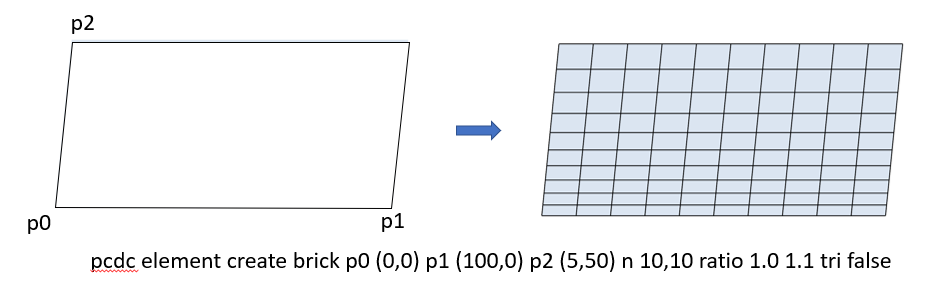

# b{rick}
pcdc e{lement} create <span style='color: red;'>b{rick}</span>
> **描述：**生成一个如图所示的四边形块体模型




**子关键词：**[p0](e{lement}/create/b{rick}/p0/)，[p1](e{lement}/create/b{rick}/p1/)，[p2](e{lement}/create/b{rick}/p2/)，[n](e{lement}/create/b{rick}/n/)，[r{atio}](e{lement}/create/b{rick}/r{atio}/)，[tri^angle](e{lement}/create/b{rick}/tri^angle/)，


**举例：**
```
pcdc element create brick p0 (0,0) p1 (100,0) p2 (5,50) n 10,10 ratio 1.0 1.1 tri false
				
#该命令生成上图所示四边形单元模型

```
