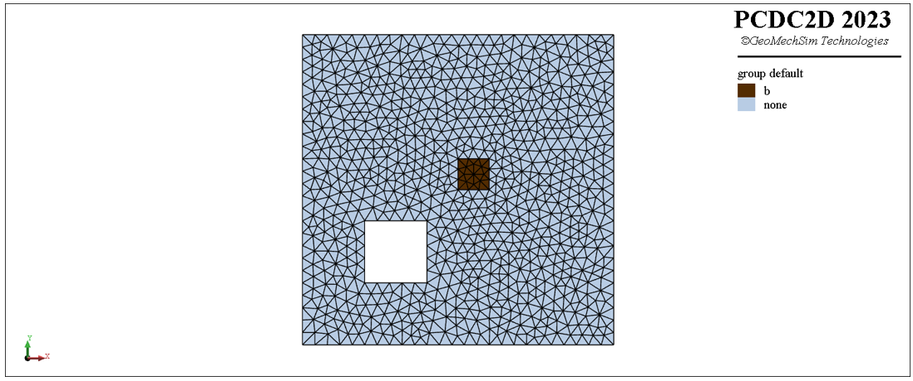

# geo{metry}-b{oundary}
pcdc e{lement} create <span style='color: red;'>geo{metry}-b{oundary}</span>
> **描述：**利用边界封闭线生成带孔洞的三角形单元模型。\n定义的边界封闭线不能相互相交

**子关键词：**[b{oundary}](e{lement}/create/geo{metry}-b{oundary}/b{oundary}/)，[i{nner}-b{oundary}](e{lement}/create/geo{metry}-b{oundary}/i{nner}-b{oundary}/)，


**举例：**
```
#下列命令利用节点集合生成如下图所示的三角形单元模型
pcdc model new
# define points
p0=(0,0)
p1=(50,0)
p2=(50,50)
p3=(0,50)
p4=(10,10)
p5=(20,10)
p6=(20,20)
p7=(10,20)
# define array
a_array=[]
a_array.append(p0)
a_array.append(p1)
a_array.append(p2)
a_array.append(p3)
b_array=[]
b_array.append(Vector(25,25))
b_array.append(Vector(30,25))
b_array.append(Vector(30,30))
b_array.append(Vector(25,30))

#create closed polyline with given point array
pcdc geometry create polyline-close [b_array] as-layer 'b'
					
#create triangular element model with defined geometry boundary
pcdc element create geometry-boundary boundary [p0] [p1] [p2] [p3] m-s 2.0 inner-boundary [a_array] m-s 2.0 inner-boundary [b_array] m-s 2.0 filled true

#group element
pcdc element group 'b' range geometry-loc 'b' ray-dir (1,0) count 1
					

```



