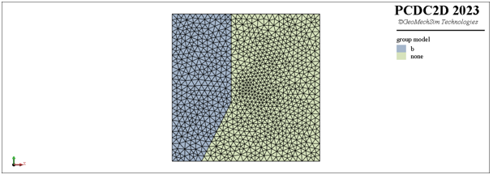

# geo{metry}-p{atch}
pcdc e{lement} create <span style='color: red;'>geo{metry}-p{atch}</span>
> **描述：**利用边界封闭折线、约束线和约束点生成三角形单元模型。\n定义在边界封闭折线以外的约束线和约束点均被自动裁剪并在生成模型时不起作用

**子关键词：**[b{oundary}-c{lose}-p{olyline}](e{lement}/create/geo{metry}-p{atch}/b{oundary}-c{lose}-p{olyline}/)，[c{onstrain}-poly{line}](e{lement}/create/geo{metry}-p{atch}/c{onstrain}-poly{line}/)，[c{onstrain}-p{oint}](e{lement}/create/geo{metry}-p{atch}/c{onstrain}-p{oint}/)，[g{lobal}-m{esh}-s{ize}](e{lement}/create/geo{metry}-p{atch}/g{lobal}-m{esh}-s{ize}/)，[t{olerance}](e{lement}/create/geo{metry}-p{atch}/t{olerance}/)，


**举例：**
```
#下列命令利用节点集合和几何线段生成如下图所示的三角形单元模型
pcdc model new
# define points
p0=(0,0)
p1=(50,0)
p2=(50,50)
p3=(0,50)
p4=(0,-20)
p5=(20,20)
p6=(20,70)
p7=(0,25)
p8=(50,25)
# define array
a_array=[]
a_array.append(p0)
a_array.append(p1)
a_array.append(p2)
a_array.append(p3)
#create a closed polyline named 'a' with point array
pcdc geometry create polyline-close [a_array] as-layer 'a'
#create a polyline named 'b'
pcdc geometry create polyline [p4] [p5] [p6] as-layer 'b'
#create triangular element model with defined geometry patch
pcdc element create geometry-patch b-c-p array [a_array] m-s 2.0 c-polyline layer 'b' m-s 2.0 c-point array (25,25) m-s 1.0 
#group element 
pcdc element group 'b' set 'model' range geometry-location 'b' ray-dir (1,0) count 1

```



