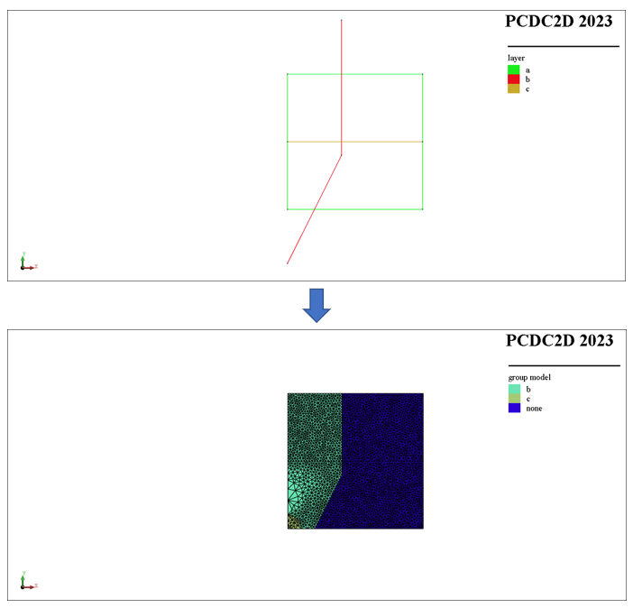

# geo{metry}
pcdc e{lement} create <span style='color: red;'>geo{metry}</span>
> **描述：**根据几何生成单元网格模型。给定一个或多个几何线段（包括折线）及其对应的网格剖分大小生成三角形单元网格模型。其中一个给定的几何必须能构成封闭面，超出封闭面的线段自动被裁剪。

**子关键词：**[layer](e{lement}/create/geo{metry}/layer/)，[cir{cle}](e{lement}/create/geo{metry}/cir{cle}/)，[arc](e{lement}/create/geo{metry}/arc/)，


**举例：**
```
#下列命令利用几何线段生成如下图所示的三角形单元模型
pcdc model new
# define points
p0=(0,0)
p1=(50,0)
p2=(50,50)
p3=(0,50)
p4=(0,-20)
p5=(20,20)
p6=(20,70)
p7=(0,25)
p8=(50,25)
#create a closed polyline named 'a'
pcdc geometry create polyline-close [p0] [p1] [p2] [p3] as-layer 'a'
#create a polyline named 'b'
pcdc geometry create polyline [p4] [p5] [p6] as-layer 'b'
#create a polyline named 'c'
pcdc geometry create polyline [p7] [p8] as-layer 'c'
#create triangular element model with defined geometry
pcdc element create geometry layer 'a' m-s 1.0 is-bound layer 'b' 'c' m-s 1.0 circle c (0,0) rad 5.0 m-s 1 
#group element 
pcdc element group 'c' set 'model' range in-circle c (0,0) rad 5.0 
pcdc element group 'b' set 'model' range geometry-location 'b' ray-dir (1,0) count 1 group 'c' set 'model' not 

```



