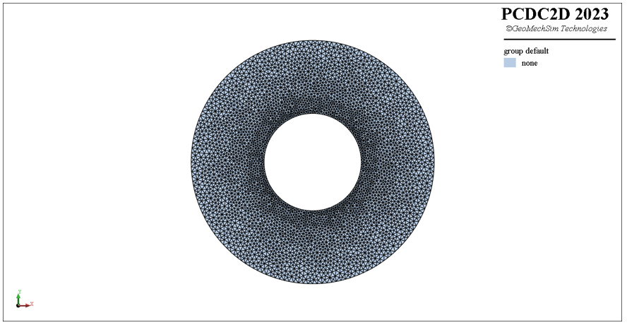

# h{ollow}-cir{cle}
pcdc e{lement} create <span style='color: red;'>h{ollow}-cir{cle}</span>
> **描述：**定义圆形内、外半径生成带圆形孔洞的三角形模型

**子关键词：**[c{enter}](e{lement}/create/h{ollow}-cir{cle}/c{enter}/)，[r{adius}](e{lement}/create/h{ollow}-cir{cle}/r{adius}/)，[i{nner}-r{adius}](e{lement}/create/h{ollow}-cir{cle}/i{nner}-r{adius}/)，


**举例：**
```
#下列命令利用节点集合生成如下图所示的三角形单元模型
pcdc model new
pcdc element create h-circle c (0,0) rad 50 m-s 2.0 i-rad 20 m-s 1.0

```



