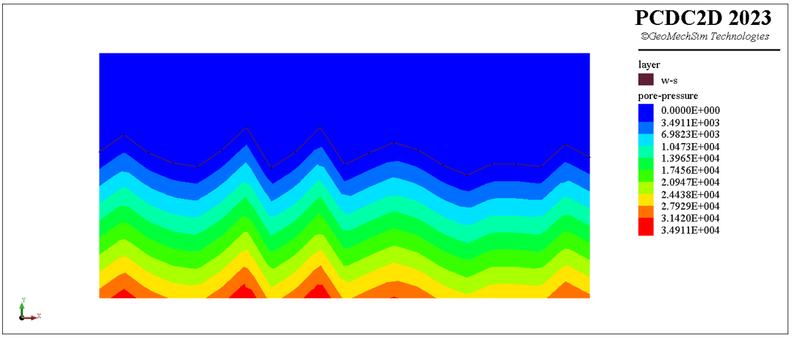

# w{ater}  < [range](range/) >
pcdc e{lement} <span style='color: red;'>w{ater}</span>
> **描述：**施加单元静水压力，静水压力将施加在单元的节点上

**子关键词：**[s{urface}](e{lement}/w{ater}/s{urface}/)，[d{ensity}](e{lement}/w{ater}/d{ensity}/)，


**举例：**
```
#下列命令随机生成水面线并根据水面线给模型赋静水压力

import random
pcdc model new
#function of creating a random water surface defined wih the array of points
			
def m_water_surface():
	dy=10
	ret=[]
	for x in range(0,105,5):
		y=random.uniform(0.0, float(dy))
		ret.append((x,y+25))
	return ret
p_array=m_water_surface()


#create elment model
pcdc element create geometry-patch b-c-p array (0,0) (100,0) (100,50) (0,50) m-s 2
#create geometry of water surface
pcdc geometry create polyline [p_array] as-layer 'w-s'
#define water pressure
pcdc element water surface 'w-s' density 1000
#update model view
pcdc view 'pcdc' update
			

```



