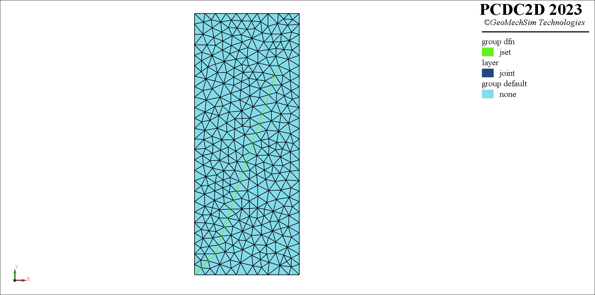

# geom{etry}-a{long}
> **描述：**在距离给定几何一定范围内和与几何体成一定角度的范围内
。可选

> 
> **值：**
> 
> s（[string](数据类型/string/)，几何层位名称）

**子关键词：**[dis{tance}-offset](range/geom{etry}-a{long}/dis{tance}-offset/)，[ang{le}-offset](range/geom{etry}-a{long}/ang{le}-offset/)，


**举例：**
```
#生成并识别如下图所示的模型节理

pcdc model new
## points
p0=(0,0)
p1=(2,2)
p2=(4,8)
p3=(8,20)
## 根据节点生成几何
pcdc geometry create polyline [p0] [p1] [p2] [p3] as-layer 'joint'
# 根据几何生成模型
pcdc element create geometry-patch boundary-close-polyline array (0,0) (10,0) (10,25) (0,25) m-s 1.0 constrain-polyline layer 'joint' m-s 1.0
# 根据范围定义模型节理组和所在类
pcdc face-joint group 'jset' set 'dfn' range geometry-along 'joint' distance-offset 0.1 angle-offset 0.1
				

```



